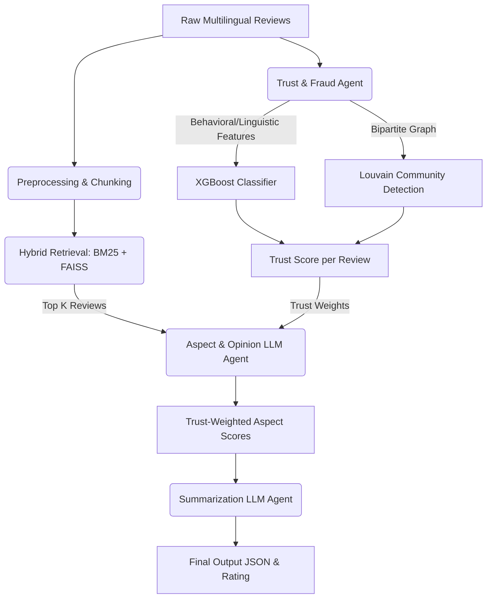

# Trust-Aware Multilingual Opinion Summarizer

An advanced multi-agent system designed to summarize e-commerce product reviews across multiple languages. Unlike standard opinion summarizers, this system incorporates a **trust-aware layer** that detects fake or manipulated reviews (using behavioral features, linguistic features, and a reviewer-product graph) and down-weights them before generating the final summary.

## Architecture



## Setup Instructions

1. **Clone the repository and install dependencies:**
   ```bash
   python3 -m venv venv
   source venv/bin/activate
   pip install -r requirements.txt
   ```

2. **Configure Ollama Mode:**
   Create a `.env` file from the example:
   ```bash
   cp .env.example .env
   ```
   The `OLLAMA_MODE` can be set to `local` (default) or `cloud`. Make sure `ollama serve` is running locally. For cloud access, run `ollama signin` first to authenticate.

3. **Running the Live API:**
   ```bash
   uvicorn src.api.main:app --host 0.0.0.0 --port 8000
   ```

4. **Running Benchmarks:**
   To compare Plain RAG, BM25-Only, and Trust-Aware RAG (outputs to `eval/` folder):
   ```bash
   python eval/run_benchmark.py --run
   python eval/run_benchmark.py --report
   ```

## Demo Strategy & Browser Extension
For live demonstrations, always use `OLLAMA_MODE=local` to avoid rate limits or network latency. The browser extension (`/extension/`) natively supports the local API out-of-the-box and provides a seamless UI overlay on supported product pages (like Amazon).

## Known Limitations
- **Linguistic Sentiment**: Basic `textblob` heuristic used as a fallback. True ABSA relies on the LLM output.
- **Graph Scalability**: In-memory `networkx` is used for collusion detection; a production environment would require a graph database like Neo4j.
